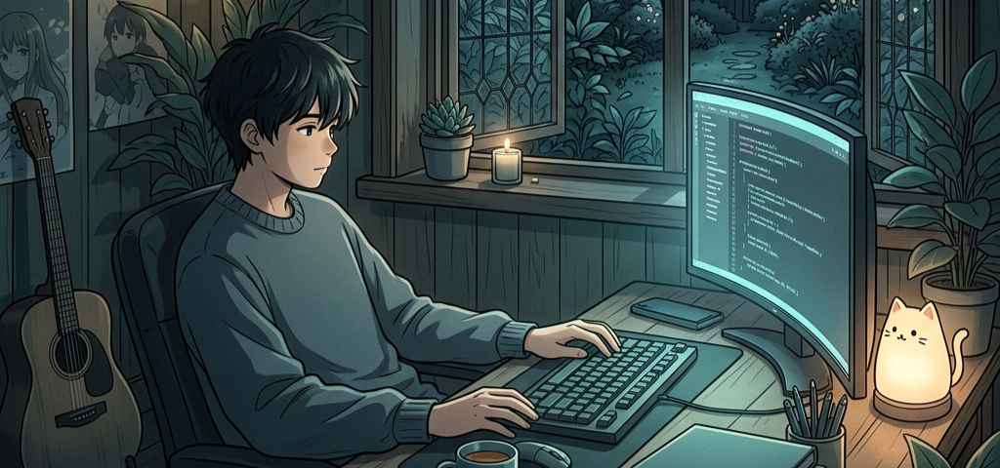

<p align="center">
  
<p align="center">
  
  
  
</p>
<p align="center">
  

<h1 align="center" style="color:#ffffff; text-shadow:0 0 20px rgba(86,138,159,0.7);">
💀 VEDANT
</h1>

<h3 align="center" style="color:#8bb4c4;">
Designer X Developer
</h3>

<p align="center"><i>"Aesthetics Matters to Me!"</i></p>

<p align="center">
  
</p>

<p align="center">
  
</p>

## 🧠 ABOUT ME

- I design cinematic interfaces that feel alive  
- Focused on motion, depth & immersive UX  
- Turning ideas into experiences 
* ⚡ Glassmorphism • 🌌 Cinematic UI • 🎬 Motion Design • 💀 Dark UI Systems

<p align="center">
  
</p>

## 🚀 DEPLOYED SYSTEMS

<p align="center">
  <a href="https://github.com/VedantBakre/Volunteer-Link">
    
  </a>
  <a href="https://github.com/VedantBakre/EduSphere">
    
  </a>
</p>

<p align="center">
  <a href="https://github.com/VedantBakre/Quick-Poll">
    
  </a>
  <a href="https://github.com/VedantBakre/QuickPoll-Beta">
    
  </a>
</p>

<p align="center">
  
</p>

## 💻 DEVELOPMENT STACK

<!-- FRONTEND -->

### ⬢ FRONTEND

<p>
  
</p>

<!-- PROGRAMMING -->

### ⬢ PROGRAMMING

<p>
  
</p>

<!-- TOOLS / DEV -->

### ⬢ TOOLS & DEV

<p>
  
</p>

<!-- DESIGN -->

### ⬢ DESIGN

<p>
  
  
  
</p>

<p align="center">
  
</p>

## 🛠 CURRENTLY BUILDING

- 🚀 QuickPoll V3 → real-time + advanced UI  
- 🎨 Personal Design System → reusable components  
- 🌐 Portfolio Website → cinematic experience
- 🌐 EduSphere 

<p align="center">
  
</p>

## 🗄️ CORE LANGUAGE VAULT

<p align="center">
  <a href="https://github.com/VedantBakre/Fun-With-IOT">
    
  </a>
  <a href="https://github.com/VedantBakre/Python-Verse">
    
  </a>
</p>
<p align="center">
  <a href="https://github.com/VedantBakre/Cpp-Verse">
    
  </a>
  <a href="https://github.com/VedantBakre/Kotlin-Playground">
    
  </a>
</p>

<p align="center">
  
</p>

## 📈 GITHUB ACTIVITY

<p align="center">
  
</p>

<p align="center">
  
</p>

## ⚡ SYSTEM STATS

<p align="center">
  
</p>

<p align="center">
  
  
</p>

<p align="center">
  
</p>

## 📊 LIVE SYSTEM DATA

<p align="center">
  
</p>

<p align="center">
  
</p>

<p align="center">
  
</p>

## 💻 LANGUAGE MATRIX

Languages I use most:

<p align="center">
  
</p>

## ⚡ SYSTEM TERMINAL

```bash
> initializing vedant.exe
> loading modules...
> UI_ENGINE ✔
> MOTION_SYSTEM ✔
> DARK_MODE ✔
> status: READY
```

<p align="center">
  
</p>

## ⚡ FUN ZONE

* 🌙 I design better at night
* 🎬 Inspired by anime & cinematic visuals
* 💀 Dark UI > Light UI
* 🎧 Music + code = flow state

<p align="center">
  
</p>


## 🐍 SYSTEM ACTIVITY

<p align="center">
  
</p>

<p align="center">
  
</p>

## 🤝 CONNECT

<p align="center">
  <a href="https://github.com/VedantBakre">
    
  </a>
  <a href="https://www.linkedin.com/in/vedant-bakre-985b72388/">
    
  </a>
  <a href="https://www.instagram.com/vedant_bakre/">
    
  </a>
  <a href="https://discord.com/users/deadskull3">
    
  </a>
</p>

<p align="center">
  <a href="mailto:vedantbakre75@gmail.com">
    
  </a>
</p>

<p align="center">
  
</p>

<p align="center">
  
</p>

<p align="center" style="color:#568a9f; font-size:14px;">
🎧 coding in rhythm
</p>
<p align="center">
  
</p>

## ⚠️ DO NOT CLICK
<details>
<summary>Access Restricted</summary>

System logs:

* Emotion Engine: ACTIVE
* Creativity: UNSTABLE
* Limits: REMOVED

You are now inside the system.

</details>

<p align="center">
  
</p>
